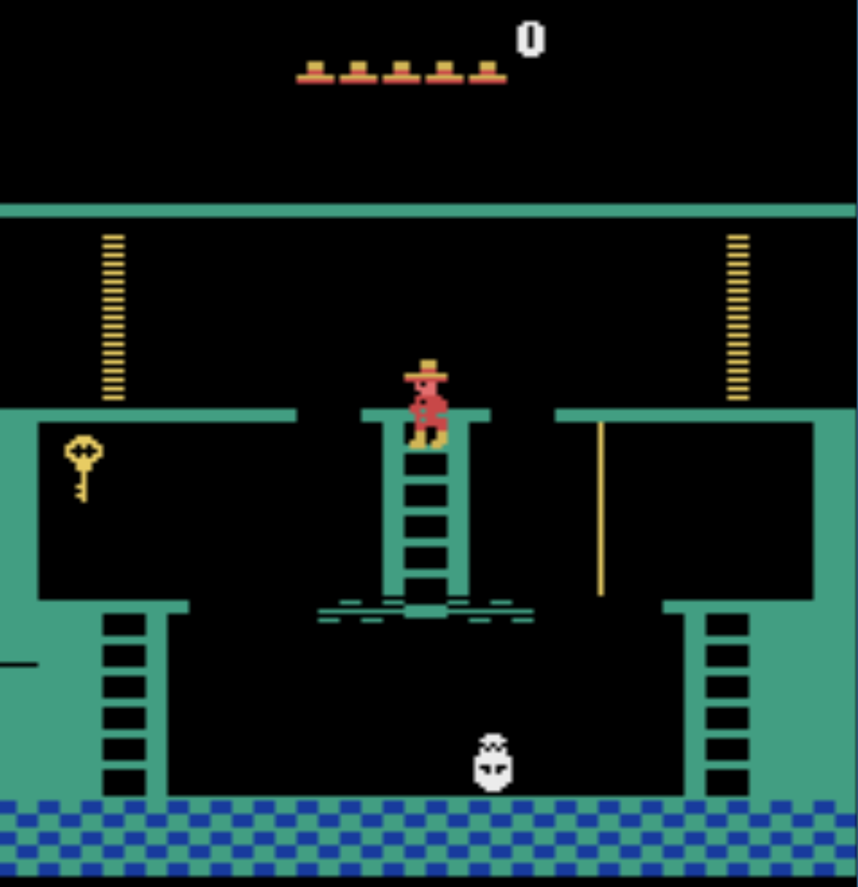

# Project: Montezumas Revenge 


For createing expert examples 



### Introduction
In order to move the character 
 Eight discrete actions are available, corresponding to:
- **`w`** - move up.
- **`s`** - move down.
- **`a`** - turn left.
- **`d`** - turn right.
- **`f`** - jump right.
- **`space`** - jump left.
- **`e`** - jumpy up.
- **`x`** - do nothing.

The game can be saved by pressing **`1`** and be loaded with **`l`**. The transitions between will not be saved in the buffer. Press **`p`** and **`s`** to exit and save the buffer.

The samples will be saved ever 100 steps in a seperate folder. 
 

### Getting Started
### Instructions
1. Clone the repository and navigate to the downloaded folder.
```	
     git clone https://github.com/ChrisProgramming2018/Montezumas_Revenge_IQL.git
     cd Montezumas_Revenge_IQL
```	
2. Create a conda enviroment 
```	
     conda create -n iql python=3.6
```
3. Activate the Enviroment
```
	conda activate iql
	cd create_expert_sampels
```

4.  **Install all dependencies**, use the requirements.txt file

```
	pip3 install -r requirements.txt
```
 

10. Start collecting samples 
```
	python create_samples.py
```

